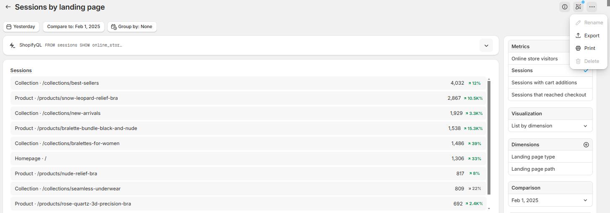

# Eby Landing

## How to Run Vite with npm

This project uses [Vite](https://vitejs.dev/) as the development server. Follow these steps to run the project:

### Prerequisites
Ensure you have [Node.js](https://nodejs.org/) installed.

### Installation
1. Clone the repository:
   ```sh
   git clone <repo-url>
   cd eby-landing
   ```
2. Install dependencies:
   ```sh
   npm install
   ```

### Running the Development Server
To start the development server, run:
```sh
npm run dev
```

## CSV File Format
CSV files need to be placed inside the `public` folder in the following format:
```
/public/Sessions by landing page - YYYY-MM-DD - YYYY-MM-DD.csv
```
Example:
```
/public/Sessions by landing page - 2025-01-23 - 2025-01-23.csv
```

### CSVs from shopify admin
Download daily .csv with conversion rate 

